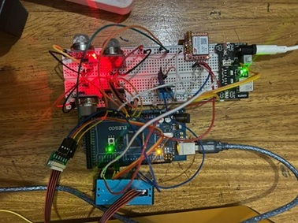

# CityAir+

**Community-Based Real-Time Carbon Emission Monitoring and Response System**



## Overview

CityAir+ is a proactive, IoT-driven air quality monitoring system designed for urban communities in Eastern and Southern Africa. By combining carbon emission sensors, visual public alerts (LEDs/screens), cloud analytics, and citizen feedback, it empowers residents and governments to respond in real time to harmful pollution events. The system enhances public health and supports climate adaptation goals aligned with SDG 11 and 13.


## Monitored Parameters

| Parameter     | Sensor   | Range                     | Health Significance                           |
|--------------|----------|---------------------------|----------------------------------------------|
| Carbon Monoxide | MQ-135 | 0 – 1000 ppm             | Critical safety parameter for worker exposure |
| VOC Index    | MQ-2/4/9 | 0 – 1000 ppm              | Industrial solvent and chemical emissions     |
| Methane      | MQ-4     | 0 – 5000 ppm              | Explosion hazard monitoring                   |
| PM₂.₅ / PM₁₀ | PMS5003  | 0 – 1000 µg m⁻³           | Respiratory health indicators                 |
| Temperature & Humidity | DHT11 | 0 – 50 °C / 20 – 90% RH | Workplace comfort and equipment conditions  |

## Architecture

### Hardware Components
- **Edge Node**: Arduino Mega 2560 with integrated sensors
- **Connectivity**: SIM800 GSM module for cellular data transmission
- **Local Alerts**: On-site buzzer and tri-color LED indicators
- **Redundancy**: SD card data buffering to prevent data loss

### Software Stack
- **Backend**: Node.js/Express API with Prisma ORM
- **Frontend**: Responsive Next.js 14 dashboard
- **Authentication**: JWT-based role-based access control
- **Data Storage**: PostgreSQL with time-series optimization

## Key Features

- **Real-time Monitoring**: Live sensor readings updated every 30 seconds
- **Critical Alerts**: 5-second response time for hazardous conditions with multi-channel notifications
- **Data Integrity**: Store-and-forward architecture ensures no data loss during connectivity issues
- **Advanced Analytics**: Historical trends, correlation analysis, and customizable reports
- **Compliance Ready**: Automatic PDF report generation for regulatory submissions
- **DevOps Integration**: Complete CI/CD pipeline from GitHub to Vercel with automated testing
- **Enterprise Security**: Role-based access control with comprehensive audit logging
- **Community Alerts**: LEDs and public screens indicate emission levels
-  **Citizen Engagement**: People can report emissions and suggest action
-  **Government Accountability**: System logs interventions and response times

## Impact Objectives

- Provide communities and city authorities with 24/7 emission data access
- Achieve >80% public awareness through LED alerts and local screens
- Drive a 15% reduction in peak emission levels through timely action
- Empower citizen engagement via real-time feedback mechanisms


<!-- ## Demo & Resources

| Resource | URL | Notes |
|----------|-----|-------|
| Public Demo | [https://iot-monitor-livid.vercel.app/](https://iot-monitor-livid.vercel.app/) | Live sensor data from our lab installation |
| Admin Dashboard | [https://factory-air-watch-m9bx.vercel.app](https://factory-air-watch-m9bx.vercel.app) | Login: `admin@example.com` / `password123` |
| Technical Blog | [https://iot-monitor-livid.vercel.app/blog](https://iot-monitor-livid.vercel.app/blog) | Implementation details and case studies |
| API Documentation | [https://factory-air-watch-m9bx.vercel.app/api-docs](https://factory-air-watch-m9bx.vercel.app/api-docs) | OpenAPI/Swagger interface |
-->
<!--
## Repository Structure

```
CityAir+/
├─ docs/           # Documentation, manuals, and design specifications
│  ├─ api/         # API documentation and endpoint reference
│  ├─ hardware/    # Component datasheets and wiring diagrams
│  └─ deployment/  # Installation and configuration guides
├─ firmware/       # PlatformIO project for Arduino Mega
│  ├─ src/         # Main firmware source code
│  ├─ lib/         # Sensor libraries and utilities
│  └─ releases/    # Signed .hex releases with checksums
├─ app/
│  ├─ api/         # Node.js/Express backend with Prisma
│  │  ├─ src/      # API source code
│  │  ├─ prisma/   # Database schema and migrations
│  │  └─ tests/    # API test suite
│  └─ dashboard/   # Next.js 14 frontend application
│     ├─ src/      # Dashboard source code
│     ├─ public/   # Static assets
│     └─ tests/    # Frontend test suite
├─ hardware/       # Hardware design files
│  ├─ schematics/  # Circuit diagrams
│  ├─ gerbers/     # PCB manufacturing files
│  └─ enclosure/   # 3D-printable enclosure STL files
├─ ci-cd/          # CI/CD configuration files
└─ images/         # Screenshots and graphics for documentation
```
-->
<!-- ## Getting Started

### Dashboard Development

```bash
# Clone the repository
git clone https://github.com/<your-org>/cityair+.git
cd CityAir+

# Set up environment variables
cp app/dashboard/.env.example app/dashboard/.env.local
cp app/api/.env.example app/api/.env

# Install dependencies and start development server
cd app/dashboard
pnpm install
pnpm dev       # Dashboard runs at http://localhost:3000

# In another terminal, start the API server
cd app/api
pnpm install
pnpm prisma migrate dev  # Set up database schema
pnpm dev       # API runs at http://localhost:3001
```

### Firmware Development

```bash
# Install PlatformIO CLI if not already installed
pip install -U platformio

# Build firmware
cd firmware
pio run -e mega2560            # Compile firmware

# Flash via USB (requires Arduino USB connection)
pio run -e mega2560 -t upload  

# Run firmware tests
pio test -e mega2560
```

### Production Deployment

For production deployment instructions, see [docs/deployment/README.md](docs/deployment/README.md).
-->
## Contributing

We welcome contributions from the community! Please follow these steps:

1. Fork the repository
2. Create a feature branch from `develop` (e.g., `feature/improved-voc-detection`)
3. Follow [Conventional Commits](https://www.conventionalcommits.org/) styling
4. Ensure all tests pass (`pnpm test` in relevant directories)
5. Maintain >80% unit test coverage for new code
6. Submit a pull request against the `develop` branch

See [CONTRIBUTING.md](CONTRIBUTING.md) for more detailed guidelines.

## Licensing

- **Firmware**: [MIT License](LICENSE-MIT.txt)
- **Dashboard/API**: [AGPL-3.0 License](LICENSE-AGPL.txt)

## Acknowledgments

This project is being developed by graduands from Makerere University and has been supported by:

- **Ubuntu Net Women Alliance 2025** 
- Makerere University – College of Computing & Informatics Technology   
- Advocacy for Digital Democracy  


## Contact

For questions or support, please contact:
- Project Lead: [project-lead@cityair+.org](mailto:project-lead@cityair+.org)
- Technical Support: [support@cityair+.org](mailto:support@cityair+.org)

---

© 2025 CityAir+
